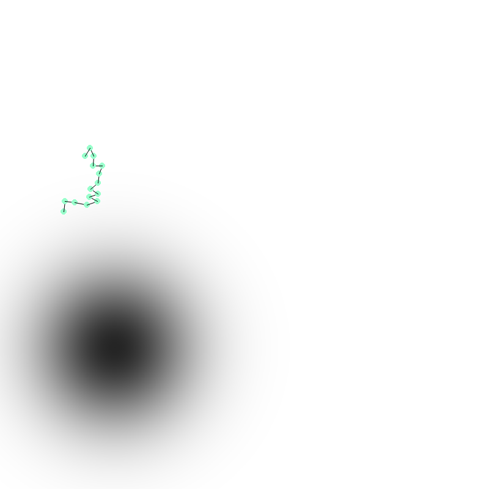

# Simulating food finding behavior in Salps

Salps are ocean creatures that are widely believed to be the most efficient example of jet propulsion in the animal kingdom. They are not very bright,
yet they participate in chaining behavior that makes them uncanny at finding areas with high concentrations of food. I am seeking to determine if I can 
reproduce this 'concentration gradient ascent' with a simple rule for each salp to follow.

A simulation was coded in python using the pymunk physics engine to simulate chain behavior and the pygame module was used to render the results in real time.
To run the simulation, simply pip install the required modules from `requirements.txt`, the important ones are listed below:
* pygame
* pymunk
* numpy
* numba (optional, but highly recommended for an FPS above 0.1).

If you would like to simply run the classic simulation, v0/salpSim.py has some decent starting parameters.

An example of a simulation frame is shown below:

